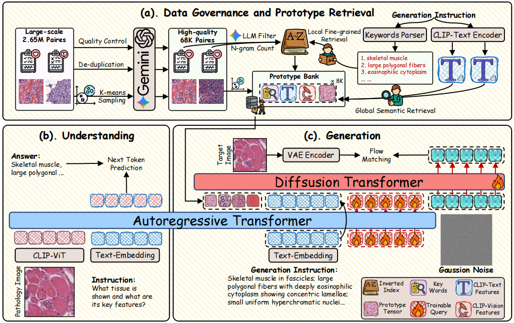

<div align="center">
<br>
<h1>Unifying Pathology Understanding and Controllable Image Synthesis with Diagnostis Semantic Guidance</h1>


</div>


**Abstract:** In computational pathology, understanding and generation have evolved along disparate paths: advanced understanding models already exhibit diagnostic-level competence, whereas generative models largely simulate pixels. Progress remains hindered by three coupled factors: the scarcity of large, high-quality image–text corpora; the lack of precise, fine-grained semantic control, which forces reliance on non-semantic cues; and terminological heterogeneity, where diverse phrasings for the same diagnostic concept impede reliable text conditioning. We introduce UniPath, a semantics-driven pathology image generation framework that leverages mature diagnostic understanding to enable controllable generation. UniPath implements Multi-Stream Control: a Raw-Text stream; a High-Level Semantics stream that uses learnable queries to a frozen pathology MLLM to distill paraphrase-robust Diagnostic Semantic Tokens and to expand prompts into diagnosis-aware attribute bundles; and a Prototype stream that affords component-level morphological control via a prototype bank. On the data front, we curate a 2.65M image–text corpus and a finely annotated, high-quality 68K subset to alleviate data scarcity. For a comprehensive assessment, we establish a four-tier evaluation hierarchy tailored to pathology. Extensive experiments demonstrate UniPath's SOTA performance, including a Patho‑FID of 80.9 (51\% better than the second-best) and fine-grained semantic control achieving 98.7\% of the real-image.

---



## Highlights
- **Semantic-first pathology generation:** shifts from pixel-level imitation to diagnosis-aware semantic control.
- **Multi-Stream Control:** combines raw text, distilled diagnostic semantic tokens, and prototype-level morphology guidance.
- **Data curation at scale:** uses a 2.65M corpus plus a high-quality 68K subset for robust training.
- **Pathology-specific evaluation:** introduces a four-tier benchmark protocol for generation quality and controllability.

## Installation
Recommended environment:
- Python 3.11
- GPU with at least 24 GB VRAM

Install dependencies:
```bash
pip install -r requirements.txt
```

## Quickstart
Run from repository root:
```bash
python src/inference.py \
  --model_path /path/to/checkpoints \
  --rag_root_dir /path/to/RAG_8K \
  --output_dir ./generated_images \
  --num_seeds 5
```

## RAG Data Requirements
`src/inference.py` expects `--rag_root_dir` to contain:
```bash
<RAG_ROOT>/
  llm_filtered_vocab_gemini_pro.txt
  keyword_inverted_index.json
  selected_8k.h5
  images/
```

## Acknowledgements
This repository substantially reuses and adapts components from:
- **Patho-R1:** https://github.com/Wenchuan-Zhang/Patho-R1
- **BLIP3o:** https://github.com/JiuhaiChen/BLIP3o/tree/main
- **PixCell-256:** https://huggingface.co/StonyBrook-CVLab/PixCell-256

We thank the original authors for open-sourcing their code and model weights.

